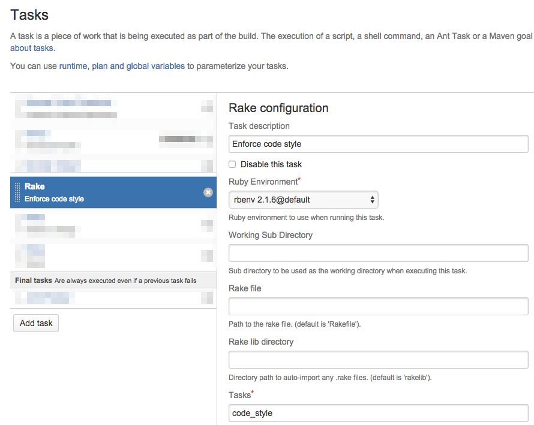

As I write more CoffeeScript on large teams, I want to be able to open a file and understand code style with little cognitive overhead. Fighting with engineers over personal opinions about writing code is never worth the time. It's a job for robots.

[CoffeeLint](http://www.coffeelint.org/) is a tool that helps enforce code conventions. You specify a set of rules and let CoffeeLint blow up CI if things aren't to your team's collective stylistic taste.

The way we resolve differences of opinion on my team is that if you don't like a certain style of writing code, be the first to disallow it by turning on a relevant CoffeeLint rule and updating all the code to be in compliance. If there isn't an existing CoffeeLint rule, author your own plugin. If someone is opinionated enough to follow through with these steps, they win the war.

## Set up

`npm install coffeelint --save-dev`

Specify your favorite rules in `coffeelint.json`. GitHub has made their [preferences](https://github.com/styleguide/javascript) publicly available.

Lint your scripts with

```sh
./node_modules/.bin/coffeelint -q <source_directory>
```

and fix anything that's out of compliance. `-q` skips output for rules marked at the "warning" level.

Hook it up to CI so you don’t have to be the jerk who tells someone when they've broken code style. Most CI services make this easy to do.

## Sample configuration with Bamboo



In this example the referenced rake task looks like this

```ruby
task :code_style do
  sh %[./node_modules/.bin/coffeelint -q source/javascripts]
end
```

Now any time CI runs through your build tasks it'll break if someone has introduced code that doesn't match the specified style. I recommend having this task run before your test suite because it's very fast and easy to fix.

Go ahead and delete that code conventions document you've been working on and look forward to a bright future where you don't have to nag people with GitHub comments about their code style.
